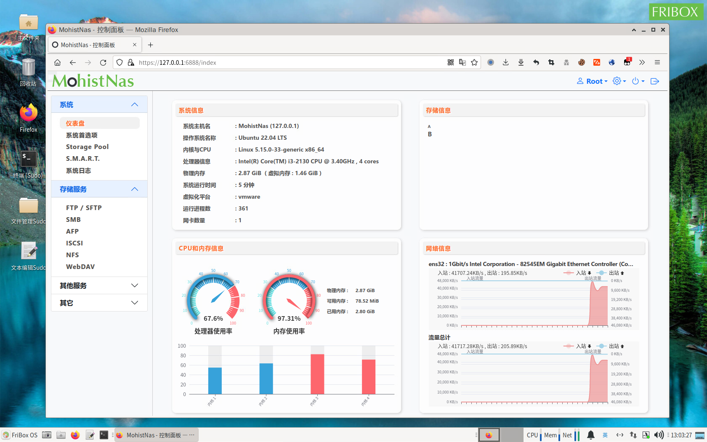

# MohistNas
Open Source Nas System （开源存储系统）

001.  20211202  注册域名mohistnas.org、mohistnas.com、mohistnas.com.cn、mohistnas.cn、mohistnas.org.cn ，创建虚拟机 Ubuntu 20.04.4 LTS ，开始第一行代码。
002.  20211203  因在虚拟机中无法获取主板上的传感器信息，改用物理机开始继续编程。确定使用Laravel框架作为WebGui的基础框架，今后可用composer及时对框架和关联组件进行更新。
003.  20211208  将项目前期的基础组件安装和设置写成sh脚本，实现用脚本可快速部署出系统的基本运行环境。
004.  20220213  更新phpsysinfo本部到v3.4.1。
005.  20220228  完成控制面板中获取硬件信息的部分。
006.  20220301  完成控制面板中CPU使用率和内存使用率图表部分。
007.  20220301  创建 github 和 gitee 开源代码库，确定使用 GPL 协议。
008.  20220320  控制面板中添加每秒更新的实时内存总数和占用数。
009.  20220321  重写控制面板中4个部分的更新机制，实现分布式更新。
010.  20220329  完成控制面板中CPU、内存、网络的3个仪表盘，已经排错。可多客户端同时运行，不影响各自的流量统计。
011.  20220530  重写获取系统信息的API，可分布式获取系统信息，无需全部获取，提高了部分效率。
